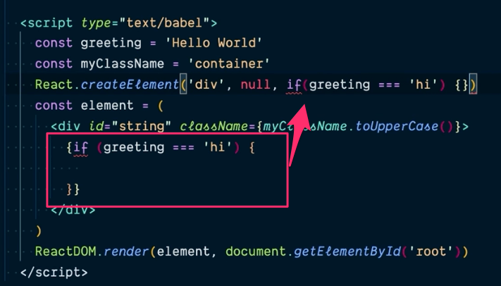

- I like that he reviews what he did in the class after it's done. It doesn't
  change much now, but when things get more complicated it may help a lot
- Started to get an idea of differences between react native and react dom (?)
- Got me curious about key/prop showing that if we don't define children as an
  array, it doesn't complain about repeated keys
- Now i know why javascript statements don't work inside {} in a JSX/React
  component
  - Details: 6:16 of
    https://epicreact.dev/modules/react-fundamentals/using-jsx-extra-credit-solution-01
    
